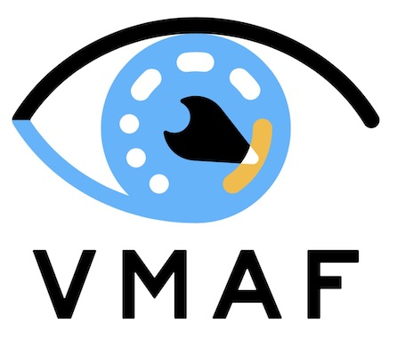

# VMAF - Video Multi-Method Assessment Fusion

VMAF is an [Emmy-winning](https://theemmys.tv/) perceptual video quality assessment algorithm developed by Netflix. This software package includes a stand-alone C library `libvmaf` and its wrapping Python library. The Python library also provides a set of tools that allows a user to train and test a custom VMAF model.

Read [this](https://medium.com/netflix-techblog/toward-a-practical-perceptual-video-quality-metric-653f208b9652) tech blog post for an overview, [this](https://medium.com/netflix-techblog/vmaf-the-journey-continues-44b51ee9ed12) post for the tips of best practices, and [this](https://netflixtechblog.com/toward-a-better-quality-metric-for-the-video-community-7ed94e752a30) post for our latest efforts on speed optimization, new API design and the introduction of a codec evaluation-friendly [NEG mode](resource/doc/models.md#disabling-enhancement-gain-neg-mode).

Also included in `libvmaf` are implementations of several other metrics: PSNR, PSNR-HVS, SSIM, MS-SSIM and CIEDE2000.

## News

- (2023-12-07) We are releasing `libvmaf v3.0.0`. It contains several optimizations and bug fixes, and a full removal of the APIs which were deprecated in `v2.0.0`.
- (2021-12-15) We have added to CAMBI the `full_ref` input parameter to allow running CAMBI as a full-reference metric, taking into account the banding that was already present on the source. Check out the [usage](resource/doc/cambi.md) page.
- (2021-12-1) We have added to CAMBI the `max_log_contrast` input parameter to allow to capture banding with higher contrasts than the default. We have also sped up CAMBI (e.g., around 4.5x for 4k). Check out the [usage](resource/doc/cambi.md) page.
- (2021-10-7) We are open-sourcing CAMBI (Contrast Aware Multiscale Banding Index) - Netflix's detector for banding (aka contouring) artifacts. Check out the [tech blog](https://netflixtechblog.medium.com/cambi-a-banding-artifact-detector-96777ae12fe2) for an overview and the [technical paper](resource/doc/papers/CAMBI_PCS2021.pdf) published in PCS 2021 (note that the paper describes an initial version of CAMBI that no longer matches the code exactly, but it is still a good introduction). Also check out the [usage](resource/doc/cambi.md) page.
- (2020-12-7) Check out our [latest tech blog](https://netflixtechblog.com/toward-a-better-quality-metric-for-the-video-community-7ed94e752a30) on speed optimization, new API design and the introduction of a codec evaluation-friendly NEG mode.
- (2020-12-3) We are releasing `libvmaf v2.0.0`. It has a new fixed-point and x86 SIMD-optimized (AVX2, AVX-512) implementation that achieves 2x speed up compared to the previous floating-point version. It also has a [new API](libvmaf/README.md) that is more flexible and extensible.
- (2020-7-13) We have created a [memo](https://docs.google.com/document/d/1dJczEhXO0MZjBSNyKmd3ARiCTdFVMNPBykH4_HMPoyY/edit?usp=sharing) to share our thoughts on VMAF's property in the presence of image enhancement operations, its impact on codec evaluation, and our solutions. Accordingly, we have added a new mode called [No Enhancement Gain (NEG)](resource/doc/models.md#disabling-enhancement-gain-neg-mode).
- (2020-2-27) We have changed VMAF's license from Apache 2.0 to [BSD+Patent](https://opensource.org/licenses/BSDplusPatent), a more permissive license compared to Apache that also includes an express patent grant.

## Documentation

There is an [overview of the documentation](resource/doc/index.md) with links to specific pages, covering FAQs, available models and features, software usage guides, and a list of resources.

## Usage

The software package offers a number of ways to interact with the VMAF implementation.

  - The command-line tool [`vmaf`](libvmaf/tools/README.md) provides a complete algorithm implementation, such that one can easily deploy VMAF in a production environment. Additionally, the `vmaf` tool provides a number of auxillary features such as PSNR, SSIM and MS-SSIM.
  - The [C library `libvmaf`](libvmaf/README.md) provides an interface to incorporate VMAF into your code, and tools to integrate other feature extractors into the library.
  - The [Python library](resource/doc/python.md) offers a full array of wrapper classes and scripts for software testing, VMAF model training and validation, dataset processing, data visualization, etc.
  - VMAF is now included as a filter in FFmpeg, and can be configured using: `./configure --enable-libvmaf`. Refer to the [Using VMAF with FFmpeg](resource/doc/ffmpeg.md) page.
  - [VMAF Dockerfile](Dockerfile) generates a docker image from the [Python library](resource/doc/python.md). Refer to [this](resource/doc/docker.md) document for detailed usage.
  - To build VMAF on Windows, follow [these](resource/doc/windows.md) instructions.
  - AOM CTC: [AOM]((http://aomedia.org/)) has specified vmaf to be the standard implementation metrics tool according to the AOM common test conditions (CTC). Refer to [this page](resource/doc/aom_ctc.md) for usage compliant with AOM CTC.

## Contribution Guide

Refer to the [contribution](CONTRIBUTING.md) page. Also refer to this [slide deck](https://docs.google.com/presentation/d/1Gr4-MvOXu9HUiH4nnqLGWupJYMeh6nl2MNz6Qy9153c/edit#slide=id.gc20398b4b7_0_132) for an overview contribution guide.
