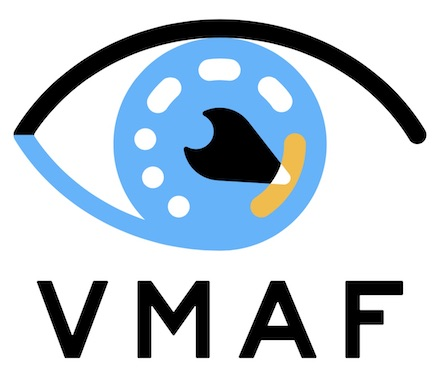

# VMAF — Lusoris Fork

[](https://github.com/lusoris/vmaf/actions/workflows/ci.yml)
[](https://github.com/lusoris/vmaf/actions/workflows/lint.yml)
[](https://github.com/lusoris/vmaf/actions/workflows/security.yml)
[](https://github.com/lusoris/vmaf/actions/workflows/libvmaf.yml)
[](https://github.com/lusoris/vmaf/actions/workflows/ffmpeg.yml)
[](LICENSE)
[](https://www.conventionalcommits.org)
[](https://securityscorecards.dev/viewer/?uri=github.com/lusoris/vmaf)
[](https://ko-fi.com/lusoris)

**A GPU-accelerated, full-precision, signed-release fork of
[Netflix/vmaf](https://github.com/Netflix/vmaf)** — perceptual video quality
assessment, Emmy-winning, now with:

- **SYCL / oneAPI** GPU backend (Intel, NVIDIA, AMD via Codeplay plugins).
- **CUDA** GPU backend (optimized ADM decouple fusion, VIF rd_stride,
  memory-efficient scoring).
- **AVX2 / AVX-512 / NEON** SIMD paths for every hot kernel.
- **`--precision`** CLI flag — default `%.17g` for IEEE-754 round-trip lossless
  scores; `legacy` opts back to upstream `%.6f`.
- **Tiny-AI** model surface (ONNX Runtime) for lightweight quality-proxy
  experiments — see [`ai/`](ai/).
- **MCP server** — expose VMAF scoring to LLM tooling via JSON-RPC. See
  [`mcp-server/vmaf-mcp/`](mcp-server/vmaf-mcp/).
- **Signed releases** — every tag carries SBOM (SPDX + CycloneDX), Sigstore
  keyless signatures, and SLSA L3 provenance.

Upstream Netflix/vmaf stays authoritative for the scoring algorithm; the fork
adds backends, tooling, and productization without changing the numerical
contract. The three Netflix CPU golden-data tests (1 normal + 2 checkerboard
pairs) run as a required CI gate on every PR — see
[`docs/principles.md`](docs/principles.md) §3.1 and decision D24.



## Quickstart

```bash
# One-liner dev env install (auto-detects Ubuntu/Arch/Fedora/Alpine/macOS/Win).
./scripts/setup/detect.sh

# CPU-only build + test.
meson setup build -Denable_cuda=false -Denable_sycl=false
ninja -C build
meson test -C build

# Score a pair.
build/tools/vmaf -r ref.yuv -d dis.yuv --width 1920 --height 1080 \
                 -p 420 -b 8 -m version=vmaf_v0.6.1 --precision=17
```

Add `-Denable_cuda=true` (requires `/opt/cuda`) or `-Denable_sycl=true`
(requires oneAPI `icpx`) to bring up a GPU backend.

## Backends at a glance

| Backend | Status | Notes                                               |
| ------- | ------ | --------------------------------------------------- |
| CPU     | ✅     | Scalar + AVX2 + AVX-512 + NEON. Golden-data truth.  |
| CUDA    | ✅     | `/opt/cuda`, `nvcc`. Works on RTX 20xx and newer.   |
| SYCL    | ✅     | oneAPI DPC++, Intel/NVIDIA/AMD via Codeplay.        |
| HIP     | 🚧     | Planned — infrastructure in place, kernels pending. |
| Vulkan  | 💭     | Experimental / future.                              |
| Metal   | 💭     | Apple Silicon — not prioritized, PRs welcome.       |

Cross-backend numerical divergence is held to ≤ 2 ULP in double precision; see
[`/cross-backend-diff`](.claude/skills/cross-backend-diff/SKILL.md) for the
verification loop.

## CLI additions (fork-only)

```text
--precision $spec
      score output precision
        N (1..17) -> printf "%.<N>g"
        max|full  -> "%.17g" (default; round-trip lossless)
        legacy    -> "%.6f" (pre-fork Netflix output)

--no_cuda                  disable CUDA backend
--no_sycl                  disable SYCL/oneAPI backend
--sycl_device $unsigned    select SYCL GPU by index (default: auto)
--gpumask: $bitmask        restrict permitted GPU operations
```

All upstream flags are preserved unchanged.

## Tiny AI

Lightweight perceptual-quality models trained and shipped in-repo, consumed
through a single ONNX Runtime-backed inference path inside libvmaf.

| # | Capability | What it is | Where it runs |
| --- | --- | --- | --- |
| C1 | **Custom FR models** | Tiny MLP regressor on the libvmaf feature vector → MOS. Drop-in for the upstream SVM. | libvmaf, `vmaf` CLI, ffmpeg `libvmaf` filter |
| C2 | **No-reference metrics** | Small CNN / MobileNet-tiny on the distorted frame alone. | libvmaf, `vmaf --no-reference`, ffmpeg filter |
| C3 | **Learned filters** | Residual CNN denoisers / sharpeners exposed through ffmpeg `vmaf_pre`. | ffmpeg `vmaf_pre`, `dnn_processing` |
| C4 | **LLM dev helpers** | Ollama-backed review / commit-msg / docgen helpers, never linked into libvmaf. | [`dev-llm/`](dev-llm/), `.claude/skills/dev-llm-*` |

- Training: [`ai/`](ai/) (`pip install -e ai && vmaf-train --help`).
- Inference runtime: [`libvmaf/src/dnn/`](libvmaf/src/dnn/) (C, ONNX Runtime).
- CLI usage: `vmaf --tiny-model model/tiny/vmaf_tiny_fr_v1.onnx [--tiny-device cuda]`.
- Meson flag: `-Denable_dnn=auto|enabled|disabled` (default `auto`).
- ffmpeg: apply [`ffmpeg-patches/*.patch`](ffmpeg-patches/) for `tiny_model=...` and the new `vmaf_pre` filter.
- Docs: [`docs/tiny-ai/`](docs/tiny-ai/).

## Documentation

- [`CLAUDE.md`](CLAUDE.md) — orientation for Claude Code sessions.
- [`AGENTS.md`](AGENTS.md) — same, for tool-agnostic agents (Cursor, Aider, Copilot).
- [`docs/principles.md`](docs/principles.md) — NASA Power-of-10 + JPL + CERT + MISRA coding standard, Netflix golden gate, quality policy.
- [`docs/sycl_bundling.md`](docs/sycl_bundling.md) — self-contained SYCL runtime bundling.
- [`docs/tiny-ai/`](docs/tiny-ai/) — training, inference, benchmarks, security.
- [`CONTRIBUTING.md`](CONTRIBUTING.md) — how to contribute (fork-specific + upstream guide preserved).
- [`SECURITY.md`](SECURITY.md) — coordinated disclosure, SLA, supply-chain guarantees.
- [Netflix/vmaf upstream docs](resource/doc/index.md) — FAQs, models, AOM CTC usage.

## Release & signing

Tagged releases use `vX.Y.Z-lusoris.N`, tracking upstream Netflix version +
fork suffix. Every release asset is:

- Signed with [Sigstore](https://sigstore.dev) keyless OIDC — verify with
  `cosign verify-blob --certificate <asset>.pem --signature <asset>.sig <asset>`.
- Accompanied by SPDX and CycloneDX SBOMs.
- Backed by [SLSA L3](https://slsa.dev) provenance via
  `slsa-github-generator` — verify with `slsa-verifier`.

Release automation: [release-please](https://github.com/googleapis/release-please)
opens a PR on every push to `master`; merging it tags and fires signing.

## License

[BSD-3-Clause-Plus-Patent](LICENSE) — preserved from upstream Netflix/vmaf.

Fork-authored code (SYCL backend, `.claude/` scaffolding, MCP server, Tiny-AI
surface) is © 2024-2026 Lusoris and Claude (Anthropic), licensed under the
same BSD-3-Clause-Plus-Patent terms as the rest of the project.

## Attribution

Upstream: [Netflix/vmaf](https://github.com/Netflix/vmaf). The scoring
algorithm, Python training harness, and the 3 Netflix CPU golden test pairs
remain Netflix's. The fork wraps, extends, and hardens — it does not replace.

Fork maintainers: [Lusoris](https://github.com/Lusoris) and
[Claude (Anthropic)](https://www.anthropic.com/claude) — co-authored.

---

## Support the fork

If the fork saves you time, [ko-fi.com/lusoris](https://ko-fi.com/lusoris)
keeps the GPU bill paid and the test rigs running.

## Upstream news & history

See [`CHANGELOG.md`](CHANGELOG.md) for fork-specific changes and the
[upstream release history](https://github.com/Netflix/vmaf/releases) for the
core VMAF algorithm evolution (CAMBI, NEG mode, v3.0.0 API overhaul, etc.).
