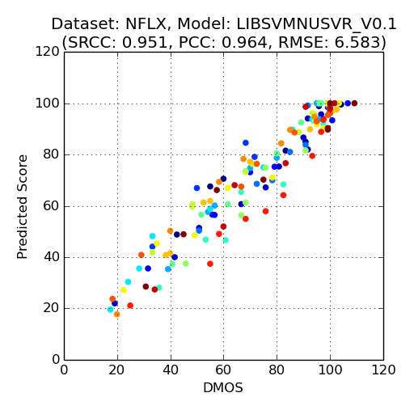
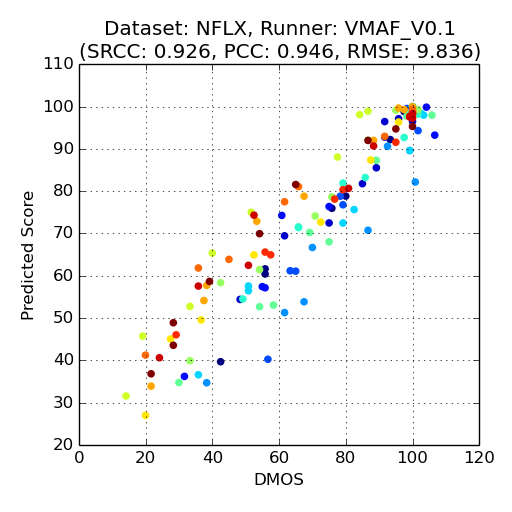
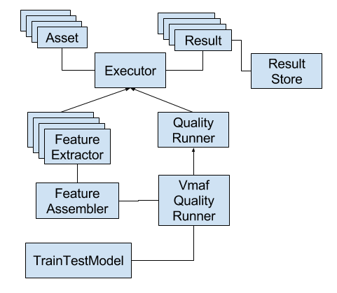

# VMAF Python Library

The VMAF Python library offers full functionalities from running basic VMAF command lines, software testing, training and validating a new VMAF model on video datasets, data visualization tools, etc. It is the playground to experiment with VMAF and other video quality metrics.

## Requirements

Make sure you have `python3` (python 3.6 or higher). You can check the version by `python3 --version`.

### Linux

On Debian Buster (10), or Debian-based systems such as Ubuntu 18.04 or higher:

```bash
sudo apt install nasm doxygen python3-dev
```

On Fedora 22 or higher, or CentOS 8 or higher:

```bash
sudo dnf install nasm doxygen python3-devel
```

On older CentOS and RHEL:

```bash
sudo yum install nasm doxygen python3-devel
```

Make sure `nasm` is 2.13.02 or higher (check by `nasm --version`).

### macOS

First, install [Homebrew](https://brew.sh/).

If you don't already have a `python3` installation on your Mac, run the following to install Python 3 via Homebrew:

```bash
brew install python3
```

Install the remaining dependencies:

```bash
brew install nasm doxygen
```

Note that `brew` requires no `sudo`.

## Set up Virtualenv

Follow the steps below to set up a clean virtual environment

```shell script
python3 -m pip install virtualenv
python3 -m virtualenv .venv
source .venv/bin/activate
```

From this point forward `python3` and `pip3` will be relative to the virtualenv and isolated from the system python. Returning to the project in subsequent shell sessions will require re-activating the virtualenv with `source .venv/bin/activate`.

Now install the tools required to build VMAF into the virtualenv.

```
pip3 install cython numpy meson ninja
```

Make sure `ninja` is 1.7.1 or higher (check by `ninja --version`).

Clean build the binary by:
```shell script
make clean; make
```

Install the rest of the required Python packages:
```shell script
pip3 install -r python/requirements.txt
```

## Testing

Run unittests and make sure they all pass:
```shell script
./unittest
```

## Command Line Tools

### Run VMAF Using `run_vmaf`

One can run VMAF in the command line by `run_vmaf`, which allows the input videos to be the `.yuv` format. To run VMAF on a single reference/distorted video pair, run:

```shell script
PYTHONPATH=python ./python/vmaf/script/run_vmaf.py \
    format width height \
    reference_path \
    distorted_path \
    [--out-fmt output_format]
```

The arguments are the following:

- `format` can be one of:
    - `yuv420p`, `yuv422p`, `yuv444p` (8-Bit YUV)
    - `yuv420p10le`, `yuv422p10le`, `yuv444p10le` (10-Bit little-endian YUV)
    - `yuv420p12le`, `yuv422p12le`, `yuv444p12le` (12-Bit little-endian YUV)
    - `yuv420p16le`, `yuv422p16le`, `yuv444p16le` (16-Bit little-endian YUV)
- `width` and `height` are the width and height of the videos, in pixels
- `reference_path` and `distorted_path` are the paths to the reference and distorted video files
- `output_format` can be one of:
    - `text`
    - `xml`
    - `json`

For example, the following command runs VMAF on a pair of `.yuv` inputs ([`src01_hrc00_576x324.yuv`](https://github.com/Netflix/vmaf_resource/blob/master/python/test/resource/yuv/src01_hrc00_576x324.yuv), [`src01_hrc01_576x324.yuv`](https://github.com/Netflix/vmaf_resource/blob/master/python/test/resource/yuv/src01_hrc01_576x324.yuv)):

```shell script
 PYTHONPATH=python ./python/vmaf/script/run_vmaf.py \
  yuv420p 576 324 \
  src01_hrc00_576x324.yuv \
  src01_hrc01_576x324.yuv \
  --out-fmt json
```

This will generate JSON output like:

```json
{
    ...
    "aggregate": {
        "VMAF_feature_adm2_score": 0.93458780776205741, 
        "VMAF_feature_motion2_score": 3.8953518541666665, 
        "VMAF_feature_vif_scale0_score": 0.36342081156994926, 
        "VMAF_feature_vif_scale1_score": 0.76664738784617292, 
        "VMAF_feature_vif_scale2_score": 0.86285338927816291, 
        "VMAF_feature_vif_scale3_score": 0.91597186913930484, 
        "VMAF_score": 76.699271371151269, 
        "method": "mean"
    }
}
```

where `VMAF_score` is the final score and the others are the scores for VMAF's elementary metrics:
- `adm2`, `vif_scalex` scores range from 0 (worst) to 1 (best)
- `motion2` score typically ranges from 0 (static) to 20 (high-motion)

### Play with Models

VMAF follows a machine-learning based approach to first extract a number of quality-relevant features (or elementary metrics) from a distorted video and its reference full-quality video, followed by fusing them into a final quality score using a non-linear regressor (e.g. an SVM regressor), hence the name “Video Multi-method Assessment Fusion”.

In addition to the basic commands, the VMAF package also provides a framework to allow any user to train his/her own perceptual quality assessment model. For example, directory [`model`](../../model) contains a number of pre-trained models, which can be loaded by the aforementioned commands:

```shell script
PYTHONPATH=python ./python/vmaf/script/run_vmaf.py \
    format width height \
    reference_path \
    distorted_path \
    [--model model_path]
```

For example:

```shell script
PYTHONPATH=python ./python/vmaf/script/run_vmaf.py \
    yuv420p 576 324 \
    python/test/resource/yuv/src01_hrc00_576x324.yuv \
    python/test/resource/yuv/src01_hrc01_576x324.yuv \
    --model model/other_models/nflxtrain_vmafv3.pkl
```

A user can customize the model based on:

- The video dataset it is trained on
- The list of features used
- The regressor used (and its hyper-parameters)

Once a model is trained, the VMAF package also provides tools to cross validate it on a different dataset and visualization.

### Create a Dataset

To begin with, create a dataset file following the format in [`example_dataset.py`](../../resource/example/example_dataset.py). A dataset is a collection of distorted videos. Each has a unique asset ID and a corresponding reference video, identified by a unique content ID. Each distorted video is also associated with subjective quality score, typically a MOS (mean opinion score), obtained through subjective study. An example code snippet that defines a dataset is as follows:

```python
dataset_name = 'example'
yuv_fmt = 'yuv420p'
width = 1920
height = 1080
ref_videos = [
    {'content_id':0, 'path':'checkerboard.yuv'},
    {'content_id':1, 'path':'flat.yuv'},
]
dis_videos = [
    {'content_id':0, 'asset_id': 0, 'dmos':100, 'path':'checkerboard.yuv'},
    {'content_id':0, 'asset_id': 1, 'dmos':50, 'path':'checkerboard_dis.yuv'},
    {'content_id':1, 'asset_id': 2, 'dmos':100, 'path':'flat.yuv'},
    {'content_id':1, 'asset_id': 3, 'dmos':80, 'path':'flat_dis.yuv'},
]
```

See the directory [`resource/dataset`](../../resource/dataset) for more examples. Also refer to the [Datasets](datasets.md) document regarding publicly available datasets.

### Validate a Dataset

Once a dataset is created, first validate the dataset using existing VMAF or other (PSNR, SSIM or MS-SSIM) metrics. Run:

```shell script
PYTHONPATH=python ./python/vmaf/script/run_testing.py \
    quality_type \
    test_dataset_file \
    [--vmaf-model optional_VMAF_model_path] \
    [--cache-result] \
    [--parallelize]
```

where `quality_type` can be `VMAF`, `PSNR`, `SSIM`, `MS_SSIM`, etc.

Enabling `--cache-result` allows storing/retrieving extracted features (or elementary quality metrics) in a data store (under `workspace/result_store_dir/file_result_store`), since feature extraction is the most expensive operations here.

Enabling `--parallelize` allows execution on multiple reference-distorted video pairs in parallel. Sometimes it is desirable to disable parallelization for debugging purpose (e.g. some error messages can only be displayed when parallel execution is disabled).

For example:

```shell script
PYTHONPATH=python ./python/vmaf/script/run_testing.py \
    VMAF \
    resource/example/example_dataset.py \
    --cache-result \
    --parallelize
```

Make sure `matplotlib` is installed to visualize the MOS-prediction scatter plot and inspect the statistics:

- PCC – Pearson correlation coefficient
- SRCC – Spearman rank order correlation coefficient
- RMSE – root mean squared error

#### Troubleshooting

When creating a dataset file, one may make errors (for example, having a typo in a file path) that could go unnoticed but make the execution of `run_testing` fail. For debugging purposes, it is recommended to disable `--parallelize`.

If the problem persists, one may need to run the script:

```shell script
PYTHONPATH=python ./python/vmaf/script/run_cleaning_cache.py \
    quality_type \
    test_dataset_file
```

to clean up corrupted results in the store before retrying. For example:

```shell script
PYTHONPATH=python ./python/vmaf/script/run_cleaning_cache.py \
    VMAF \
    resource/example/example_dataset.py
```

### Train a New Model

Now that we are confident that the dataset is created correctly and we have some benchmark result on existing metrics, we proceed to train a new quality assessment model. Run:

```shell script
PYTHONPATH=python ./python/vmaf/script/run_vmaf_training.py \
    train_dataset_filepath \
    feature_param_file \
    model_param_file \
    output_model_file \
    [--cache-result] \
    [--parallelize]
```

For example:

```shell script
PYTHONPATH=python ./python/vmaf/script/run_vmaf_training.py \
    resource/example/example_dataset.py \
    resource/feature_param/vmaf_feature_v2.py \
    resource/model_param/libsvmnusvr_v2.py \
    workspace/model/test_model.pkl \
    --cache-result \
    --parallelize
```

`feature_param_file` defines the set of features used. For example, both dictionaries below:

```python
feature_dict = {'VMAF_feature': 'all', }
```

and

```python
feature_dict = {'VMAF_feature': ['vif', 'adm'], }
```

are valid specifications of selected features. Here `VMAF_feature` is an "aggregate" feature type, and `vif`, `adm` are the "atomic" feature types within the aggregate type. In the first case, `all` specifies that all atomic features of `VMAF_feature` are selected. A `feature_dict` dictionary can also contain more than one aggregate feature types.

`model_param_file` defines the type and hyper-parameters of the regressor to be used. For details, refer to the self-explanatory examples in directory `resource/model_param`. One example is:

```python
model_type = "LIBSVMNUSVR"
model_param_dict = {
    # ==== preprocess: normalize each feature ==== #
    'norm_type':'clip_0to1',  # rescale to within [0, 1]
    # ==== postprocess: clip final quality score ==== #
    'score_clip':[0.0, 100.0],  # clip to within [0, 100]
    # ==== libsvmnusvr parameters ==== #
    'gamma':0.85, # selected
    'C':1.0,  # default
    'nu':0.5,  # default
    'cache_size':200,  # default
}
```

The trained model is output to `output_model_file`. Once it is obtained, it can be used by the `run_vmaf`, or by `run_testing` to validate another dataset.




Above are two example scatter plots obtained from running the `run_vmaf_training` and `run_testing` commands on a training and a testing dataset, respectively.

### Using Custom Subjective Models

The commands `run_vmaf_training` and `run_testing` also support custom subjective models (e.g. MLE_CO_AP2 (default), MOS, DMOS, SR_MOS (i.e. ITU-R BT.500), BR_SR_MOS (i.e. ITU-T P.913) and more), through the [sureal](https://github.com/Netflix/sureal) package.

The subjective model option can be specified with option `--subj-model subjective_model`, for example:

```shell script
PYTHONPATH=python ./python/vmaf/script/run_vmaf_training.py \
    resource/example/example_raw_dataset.py \
    resource/feature_param/vmaf_feature_v2.py \
    resource/model_param/libsvmnusvr_v2.py \
    workspace/model/test_model.pkl \
    --subj-model MLE_CO_AP2 \
    --cache-result \
    --parallelize

PYTHONPATH=python ./python/vmaf/script/run_testing.py \
    VMAF \
    resource/example/example_raw_dataset.py \
    --subj-model MLE_CO_AP2 \
    --cache-result \
    --parallelize
```

Note that for the `--subj-model` option to have effect, the input dataset file must follow a format similar to [example_raw_dataset.py](../../resource/example/example_raw_dataset.py). Specifically, for each dictionary element in `dis_videos`, instead of having a key named `dmos` or `groundtruth` as in [example_dataset.py](../../resource/example/example_dataset.py), it must have a key named `os` (stands for opinion score), and the value must be a list of numbers. This is the "raw opinion score" collected from subjective experiments, which is used as the input to the custom subjective models.

### Cross Validation

[`run_vmaf_cross_validation.py`](../../python/script/run_vmaf_cross_validation.py) provides tools for cross-validation of hyper-parameters and models. `run_vmaf_cv` runs training on a training dataset using hyper-parameters specified in a parameter file, output a trained model file, and then test the trained model on another test dataset and report testing correlation scores. `run_vmaf_kfold_cv` takes in a dataset file, a parameter file, and a data structure (list of lists) that specifies the folds based on video content's IDs, and run k-fold cross valiation on the video dataset. This can be useful for manually tuning the model parameters.

### Creating New Features And Regressors

You can also customize VMAF by plugging in third-party features or inventing new features, and specify them in a `feature_param_file`. Essentially, the "aggregate" feature type (for example: `VMAF_feature`) specified in the `feature_dict` corresponds to the `TYPE` field of a `FeatureExtractor` subclass (for example: `VmafFeatureExtractor`). All you need to do is to create a new class extending the `FeatureExtractor` base class.

Similarly, you can plug in a third-party regressor or invent a new regressor and specify them in a `model_param_file`. The `model_type` (for example: `LIBSVMNUSVR`) corresponds to the `TYPE` field of a `TrainTestModel` sublass (for example: `LibsvmnusvrTrainTestModel`). All needed is to create a new class extending the `TrainTestModel` base class.

For instructions on how to extending the `FeatureExtractor` and `TrainTestModel` base classes, refer to [`CONTRIBUTING.md`](../../CONTRIBUTING.md).

## Analysis Tools

Overtime, a number of helper tools have been incorporated into the package, to facilitate training and validating VMAF models. An overview of the tools available can be found in [this slide deck](presentations/VQEG_SAM_2018_111_AnalysisToolsInVMAF.pdf).

### BD-Rate Calculator

A Bjøntegaard-Delta (BD) rate [implementation](../../python/vmaf/tools/bd_rate_calculator.py) is added. Example usage can be found [here](../../python/test/bd_rate_calculator_test.py). The implementation is validated against [MPEG JCTVC-L1100](http://phenix.int-evry.fr/jct/doc_end_user/current_document.php?id=7281).

### LIME (Local-Explainer Model-Agnostic Explanation) Implementation

An implementation of [LIME](https://arxiv.org/pdf/1602.04938.pdf) is also added as part of the repository. For more information, refer to our [analysis tools](presentations/VQEG_SAM_2018_111_AnalysisToolsInVMAF.pdf) presentation. The main idea is to perform a local linear approximation to any regressor or classifier and then use the coefficients of the linearized model as indicators of feature importance. LIME can be used as part of the VMAF regression framework, for example:

```shell script
PYTHONPATH=python ./python/vmaf/script/run_vmaf.py \
    yuv420p 576 324 \
    src01_hrc00_576x324.yuv \
    src01_hrc00_576x324.yuv \
    --local-explain
```

Naturally, LIME can also be applied to any other regression scheme as long as there exists a pre-trained model. For example, applying to BRISQUE:

```shell script
PYTHONPATH=python ./python/vmaf/script/run_vmaf.py yuv420p 576 324 \
    src01_hrc00_576x324.yuv \
    src01_hrc00_576x324.yuv \
    --local-explain \
    --model model/other_models/nflxall_vmafv1.pkl
```

## Format Tools

### Convert Model File from pickle (pkl) to json

A tool to convert a model file (currently support libsvm model) from pickle to json is added at `python/vmaf/script/convert_model_from_pkl_to_json.py`. Usage:
```text
usage: convert_model_from_pkl_to_json.py [-h] --input-pkl-filepath
                                         INPUT_PKL_FILEPATH
                                         --output-json-filepath
                                         OUTPUT_JSON_FILEPATH

optional arguments:
  -h, --help            show this help message and exit
  --input-pkl-filepath INPUT_PKL_FILEPATH
                        path to the input pkl file, example:
                        model/vmaf_float_v0.6.1.pkl or
                        model/vmaf_float_b_v0.6.3/vmaf_float_b_v0.6.3.pkl
  --output-json-filepath OUTPUT_JSON_FILEPATH
                        path to the output json file, example:
                        model/vmaf_float_v0.6.1.json or model/vmaf_float_b_v0.6.3.json
```

Examples:
```shell script

python/vmaf/script/convert_model_from_pkl_to_json.py \
--input-pkl-filepath model/vmaf_float_b_v0.6.3/vmaf_float_b_v0.6.3.pkl \
--output-json-filepath ./vmaf_float_b_v0.6.3.json

python/vmaf/script/convert_model_from_pkl_to_json.py \
--input-pkl-filepath model/vmaf_float_v0.6.1.pkl \
--output-json-filepath ./vmaf_float_v0.6.1.json
```

## Core Classes

The core classes of the VMAF Python library can be depicted in the diagram below:



### Asset

An Asset is the most basic unit with enough information to perform a task on a media. It includes basic information about a distorted video and its undistorted reference counterpart, as well as the auxiliary preprocessing information that can be understood by the `Executor` and its subclasses. For example: 
  - The frame range on which to perform a task (i.e. `dis_start_end_frame` and `ref_start_end_frame`)
  - At what resolution to perform a task (e.g. a video frame is upscaled with a `resampling_type` method to the resolution specified by `quality_width_hight` before feature extraction)

Asset extends the `WorkdirEnabled` mixin, which comes with a thread-safe working directory to facilitate parallel execution.

### Executor

An `Executor` takes a list of `Assets` as input, run computations on them, and return a list of corresponding `Results`. An `Executor` extends the `TypeVersionEnabled` mixin, and must specify a unique type and version combination (by the `TYPE` and `VERSION` attribute), so that the `Result` generated by it can be uniquely identified. This facilitates a number of shared housekeeping functions, including storing and reusing `Results` (`result_store`), creating FIFO pipes (`fifo_mode`), etc. `Executor` understands the preprocessing steps specified in its input `Assets`. It relies on FFmpeg to do the processing for it (FFmpeg must be pre-installed and its path specified in the `FFMPEG_PATH` field in the `python/vmaf/externals.py` file).

An `Executor` and its subclasses can take optional parameters during initialization. There are two fields to put the optional parameters:
  - `optional_dict`: a dictionary field to specify parameters that will impact numerical result (e.g. which wavelet transform to use).
  - `optional_dict2`: a dictionary field to specify parameters that will NOT impact numerical result (e.g. outputting optional results).

`Executor` is the base class for `FeatureExtractor` and `QualityRunner` (and the sub-subclass `VmafQualityRunner`).

### Result

A `Result` is a key-value store of read-only execution results generated by an `Executor` on an `Asset`. A key corresponds to an "atom" feature type or a type of a quality score, and a value is a list of score values, each corresponding to a computation unit (i.e. in the current implementation, a frame).

The `Result` class also provides a number of tools for aggregating the per-unit scores into an average score. The default aggregatijon method is the mean, but `Result.set_score_aggregate_method()` allows customizing other methods (see `test_to_score_str()` in `test/result_test.py` for examples).

### ResultStore

`ResultStore` provides capability to save and load a `Result`. Current implementation `FileSystemResultStore` persists results by a simple file system that save/load result in a directory. The directory has multiple subdirectories, each corresponding to an `Executor`. Each subdirectory contains multiple files, each file storing the dataframe for an `Asset`.

### FeatureExtractor

`FeatureExtractor` subclasses `Executor`, and is specifically for extracting features (aka elementary quality metrics) from `Assets`. Any concrete feature extraction implementation should extend the `FeatureExtractor` base class (e.g. `VmafFeatureExtractor`). The `TYPE` field corresponds to the "aggregate" feature name, and the `ATOM_FEATURES`/`DERIVED_ATOM_FEATURES` field corresponds to the "atom" feature names.

### FeatureAssembler

`FeatureAssembler` assembles features for an input list of `Assets` on a input list of `FeatureExtractor` subclasses. The constructor argument `feature_dict` specifies the list of `FeatureExtractor` subclasses (i.e. the "aggregate" feature) and selected "atom" features. For each asset on a `FeatureExtractor`, it outputs a `BasicResult` object. `FeatureAssembler` is used by a `QualityRunner` to assemble the vector of features to be used by a `TrainTestModel`.

### TrainTestModel

`TrainTestModel` is the base class for any concrete implementation of regressor, which must provide a `train()` method to perform training on a set of data and their groud-truth labels, and a `predict()` method to predict the labels on a set of data, and a `to_file()` and a `from_file()` method to save and load trained models. 

A `TrainTestModel` constructor must supply a dictionary of parameters (i.e. `param_dict`) that contains the regressor's hyper-parameters. The base class also provides shared functionalities such as input data normalization/output data denormalization, evaluating prediction performance, etc.

Like an `Executor`, a `TrainTestModel` extends `TypeVersionEnabled` and must specify a unique type and version combination (by the `TYPE` and `VERSION` attribute).

### CrossValidation

`CrossValidation` provides a collection of static methods to facilitate validation of a `TrainTestModel` object. As such, it also provides means to search the optimal hyper-parameter set for a `TrainTestModel` object.

### QualityRunner

`QualityRunner` subclasses `Executor`, and is specifically for evaluating the quality score for `Assets`. Any concrete implementation to generate the final quality score should extend the `QualityRunner` base class (e.g. `VmafQualityRunner`, `PsnrQualityRunner`).

There are two ways to extend a `QualityRunner` base class -- either by directly implementing the quality calculation (e.g. by calling a C executable, as in `PsnrQualityRunner`), or by calling a `FeatureAssembler` (with indirectly calls a `FeatureExtractor`) and a `TrainTestModel` subclass (as in `VmafQualityRunner`).
