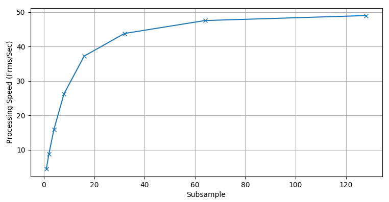

`vmafossexec` -- a C++ Executable
===================

The package combines feature extraction implementation in C and the rest scripting code in Python. The Python layer allows fast prototyping, but sometimes deploying the Python dependency in production is a pain. Under `libvmaf/build/tools`, we provide a C++ executable `vmafossexec` that has no dependency on Python.

To build `vmafossexec`, follow the instrunctions to build [libvmaf](../../libvmaf/README.md#compile).

You will find `vmafossexec` in `libvmaf/build/tools/vmafossexec`, run `vmafossexec` as:

```shell script
libvmaf/build/tools/vmafossexec yuv420p 576 324 \
    src01_hrc00_576x324.yuv \
    src01_hrc01_576x324.yuv \
    model/vmaf_float_v0.6.1.pkl \
    --log /dev/stdout \
    --psnr --ssim --ms-ssim \
    --thread 0 \
    --subsample 5
```

For VMAF v0.6.1, the model file is `model/vmaf_v0.6.1.json`.

The options `--psnr`, `--ssim` and `--ms-ssim` also allow reporting PSNR, SSIM and MS-SSIM results, respectively. The option `--thread` specifies the number of threads to use. Apply `--thread 0` to use all threads available. The option `--subsample` specifies the subsampling of frames to speed up calculation. For example, `--subsample 5` calculates VMAF on one of every 5 frames. The following plot shows the trend of how the subsample number impacts the processing speed (based on the [Netflix Public Dataset](datasets.md#netflix-public-dataset) of 1080p videos, with PSNR, SSIM and MS-SSIM calculation enabled):



Optionally, one can test `vmafossexec` by running the [`vmafossexec_test.py`](../../python/test/vmafossexec_test.py) script, run the following command (which creates a virtual environment, and installs vmaf with all its dependencies into it):

```shell script
rm -rf .venv/
python3 -mvenv .venv
.venv/bin/pip install pytest -e python/
.venv/bin/pytest python/test/vmafossexec_test.py
```

Expect all tests pass.
